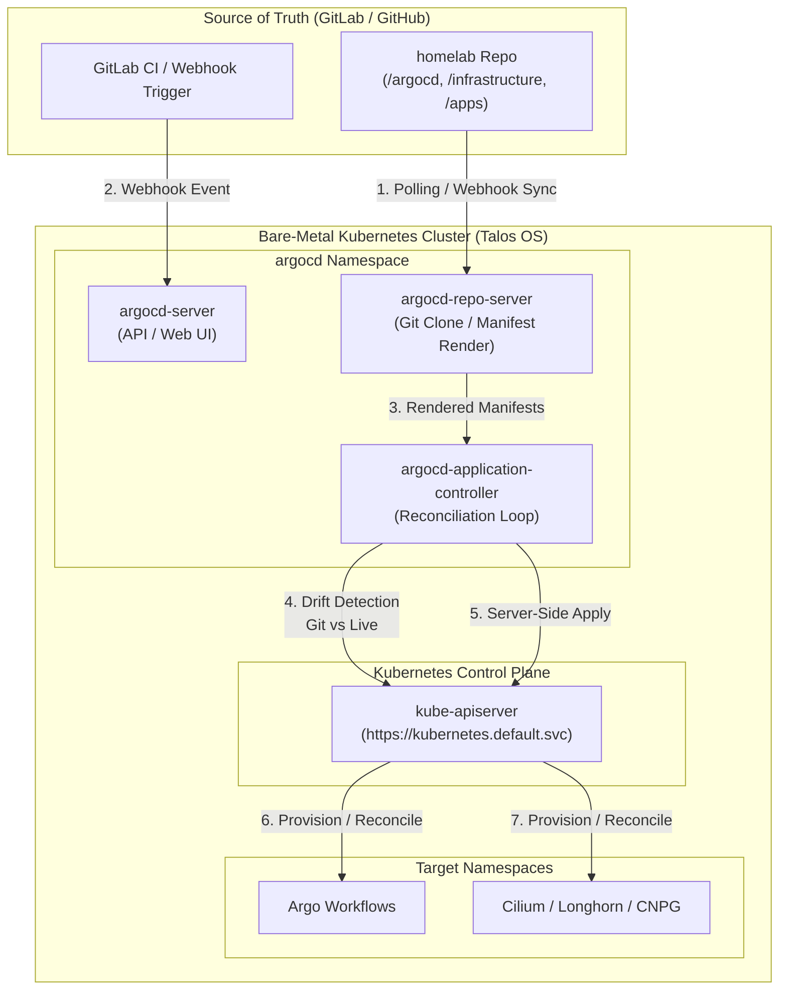

# ArgoCD Controller Layer (`/argocd`)

This directory serves as the root controller layer for cluster lifecycle management, containing the bootstrap manifests and the App-of-Apps root configuration.

---

## Directory Component Index

* **[kustomization.yaml](./kustomization.yaml)**: Declarative Kustomize manifest that pulls the official upstream High Availability (HA) ArgoCD v2.11.3 base manifests and applies `root-app.yaml` in the `argocd` namespace.
* **[root-app.yaml](./root-app.yaml)**: The primary App-of-Apps `Application` CRD. It establishes automated GitOps synchronization targeting the `argocd/apps/` directory in this repository.
* **[apps](./apps)**: Directory containing individual child `Application` CRD manifests (e.g., Argo Workflows, Longhorn, CloudNativePG) automatically reconciled by `root-app.yaml`.

---

## Architecture & Integration Primer



### 1. The Pull-Based GitOps Paradigm
Traditional CI/CD relies on push-based operations where an external CI worker (e.g., GitLab Runner) executes `kubectl apply` over an exposed control plane port. 

ArgoCD operates on a **Pull-Based Controller Model**:
* **Internal Agent Deployment:** ArgoCD runs natively inside the cluster (`argocd` namespace).
* **Zero Ingress Attack Surface for Control Plane:** The cluster does not expose its `kube-apiserver` (port 6443) to GitLab or external networks. ArgoCD initiates outbound connections over HTTPS to poll or fetch updates from Git.

---

### 2. Core Subsystem Responsibilities

1. **`argocd-repo-server` (Git & Manifest Rendering Engine)**
   * Clones the repository target revision (branch/tag/SHA).
   * Renders raw manifests, Kustomize overlays, or Helm charts into standard K8s YAML objects in-memory.

2. **`argocd-application-controller` (Reconciliation & State Loop)**
   * Continuously queries the live `kube-apiserver` for active resources.
   * Computes a 3-way diff between:
     1. Desired State (Rendered Git manifests).
     2. Live State (Current cluster state).
     3. Last Applied State (`kubectl.kubernetes.io/last-applied-configuration`).
   * Executes reconciliation via Kubernetes Server-Side Apply if drift is detected.

3. **`argocd-server` (API & Ingress Gateway)**
   * Exposes Web UI and gRPC endpoints for operator interaction.
   * Receives incoming webhook notifications from GitLab to trigger instant reconciliation cycles.

---

### 3. GitLab Integration & Sync Mechanics

* **Continuous Polling (Default Baseline):** ArgoCD polls GitLab every 3 minutes to detect new commits on the configured branch (`targetRevision: HEAD`).
* **Webhook Instant Sync (Low-Latency Integration):** 
  A GitLab webhook targets `https://<argocd-server-host>/api/webhook`. Upon `push` events, GitLab notifies ArgoCD, bypassing the 3-minute poll delay and triggering instant manifest rendering.
* **Automated Self-Healing (`selfHeal: true`):**
  If an operator manually modifies or deletes a cluster resource using `kubectl`, the controller detects the diff within seconds and overwrites the manual edit, restoring Git state authority.
* **Automated Pruning (`prune: true`):**
  When a manifest file is removed from GitLab, ArgoCD garbage-collects the corresponding resource from the cluster.

---

## Operational Bootstrap & Validation

```bash
# 1. Apply declarative ArgoCD Kustomization bundle
kubectl apply -k argocd/

# 2. Verify controller component health
kubectl get pods -n argocd

# 3. Retrieve initial admin credential for UI access
kubectl -n argocd get secret argocd-initial-admin-secret -o jsonpath="{.data.password}" | base64 --decode; echo

# 4. Port-forward UI to local host
kubectl port-forward -n argocd svc/argocd-server 8080:443
```