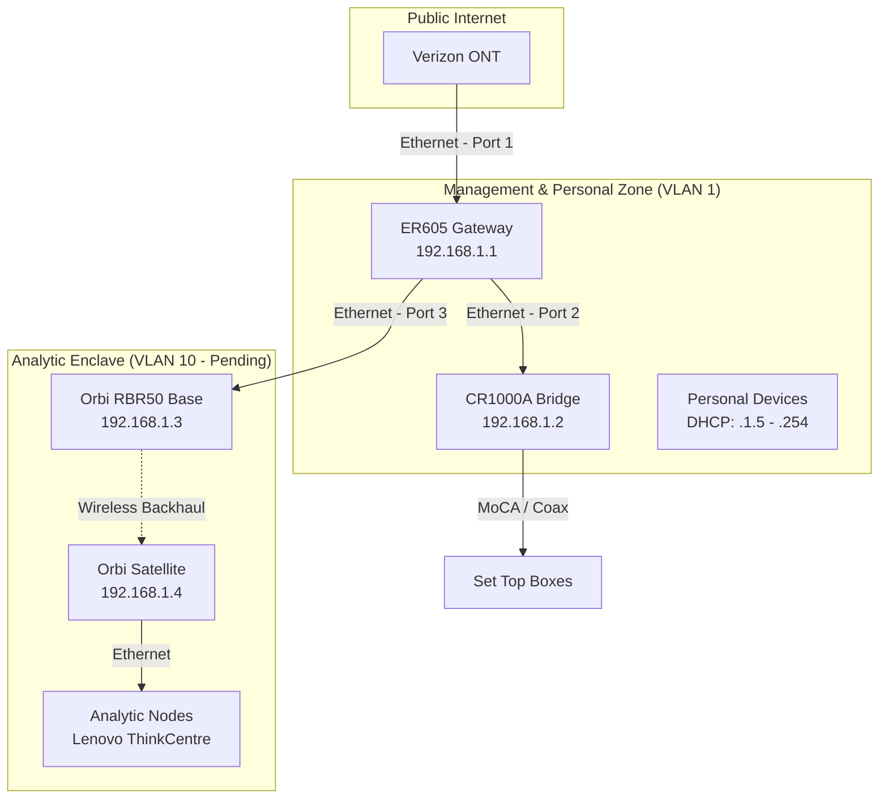

# Epic 0: Project & Environment Stabilization

## Current Status: COMPLETED
**Objective:** Establish a stable, unified management plane and secure the physical-to-logical mapping of the homelab foundation.

### Technical Summary
We transitioned from a "Dual-Router" conflict (Double NAT) to a **Unified Gateway Architecture**. The TP-Link ER605 has been designated as the "Primary Authority," while the Verizon CR1000A has been demoted to a "Media & WiFi Bridge." The Orbi mesh system is now anchored with static assignments to serve as the Enclave's backhaul.

### The "Why" (Architectural Decisions)
1.  **Subnet Alignment:** We pivoted from the `192.168.0.x` subnet to `192.168.1.x`. While `0.x` is a common default, the Verizon CR1000A firmware demonstrated significant "Subnet Gravity," resisting changes to its native `.1.x` range. To prioritize stability over aesthetics, we moved the ER605 into the `.1.x` neighborhood.
2.  **Authority Consolidation:** DHCP was disabled on the CR1000A to prevent "DHCP Racing." The ER605 now manages all IP assignments, ensuring a single "Source of Truth" for network identity.
3.  **Static Anchoring:** The Orbi Base and Satellite have been assigned fixed IPs (`.1.3` and `.1.4`) to ensure that the "Wireless Standoff" link remains reachable and consistent for monitoring analytic workloads.

### Physical Topology & Management Plane

