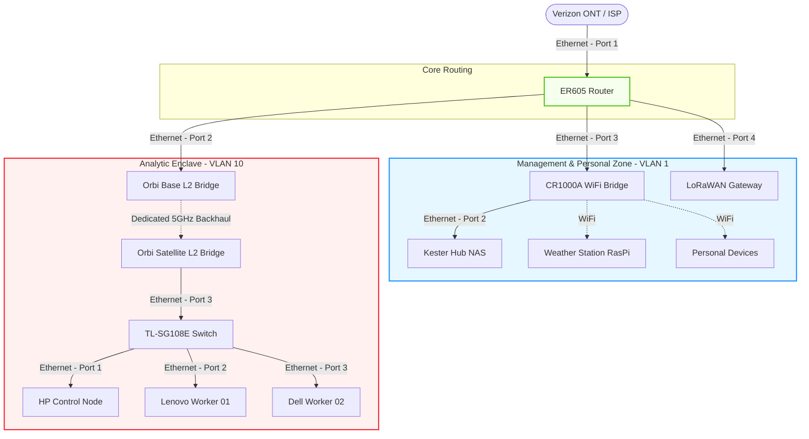

# Blueprint: Physical Network & L1 Topology

## 1. Abstract
This document defines the physical cabling and Layer 2 connectivity for the GitOps Lab. It establishes the "Analytic Enclave" and the management zone, ensuring that the ER605 remains the authoritative gateway while isolating the Kubernetes cluster into a dedicated fault domain.

## 2. Logical Design
The network utilizes a hybrid topology due to physical cabling constraints. The Verizon CR1000A operates in a bridge/passthrough capacity for the personal LAN. The Orbi RBR50 mesh system has been repurposed as a dedicated Point-to-Point Layer 2 bridge to deliver the VLAN 10 fault domain to the cluster aggregation switch, bypassing its inability to process 802.1q tags (See ADR-0002).

### Topology Diagram

## 3. Implementation Details  

* **Primary Gateway:** ER605 (192.168.1.1) manages routing and state for all VLANs.
* **VLAN 1 (Management/Personal):** * `192.168.1.0/24` via ER605 Port 3.
  * Static assignments for infrastructure (.1 through .4).  
  * DHCP pool for transient personal devices (.5 through .254).
* **VLAN 10 (Analytic Enclave):**
  * `10.10.10.0/24` via ER605 Port 2 (Access Mode/PVID 10).
  * Orbi mesh strictly passes untagged L2 frames.
  * Switch localizes all intra-cluster synchronous state to line-rate copper.

## 4. Resilience & Failure Domains  

* **Gateway Routing SPOF:** The ER605 is the primary SPOF for external connectivity. Recovery requires a cold spare ER605 or fallback to the CR1000A.
* **Ingress/Egress Contention:** Egress traffic from the cluster traverses the Orbi wireless backhaul. Heavy off-site backups or image pulls may experience latency/contention.
* **Intra-Cluster I/O Protection:** Node-to-node traffic (etcd, Longhorn replication) never traverses the wireless backhaul, protecting cluster quorum from RF interference.