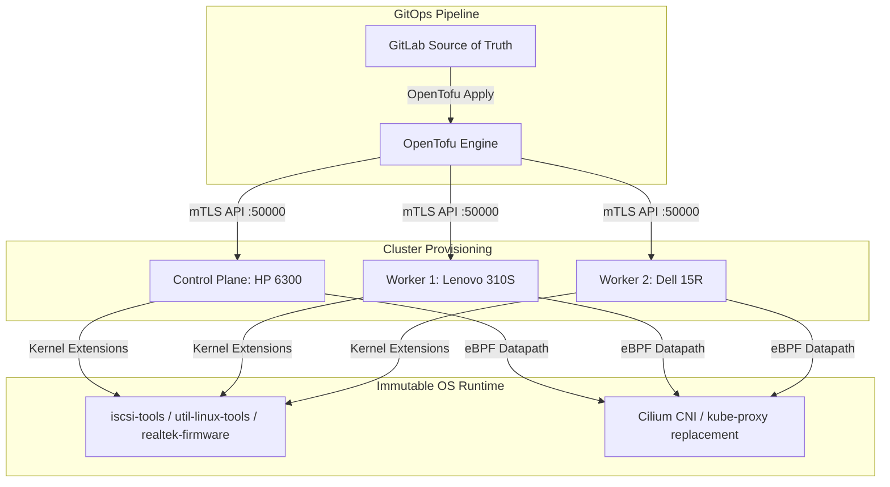

# Blueprint: Talos Linux Provisioning & Immutable OS Architecture

## 1. Abstract
This document defines the Layer II provisioning standard and operating system architecture for the GitOps Lab. It establishes Talos Linux as an immutable, API-driven control plane and worker plane runtime, stripping away traditional shell access in favor of declarative machine configurations enforced via OpenTofu and managed through `talosctl`.

## 2. Logical Design
Talos Linux runs entirely from an ephemeral initramfs with root filesystem integrity maintained cryptographically. Configuration state is expressed declaratively via YAML manifests and applied over mTLS. 

### Architecture Model

## 3. Implementation & System Extensions

To support heterogeneous bare-metal hardware and satisfy downstream storage primitives (Longhorn), custom image schematics are compiled via the Sidero Image Factory (`factory.talos.dev`).

### Image Schematic Mapping
* **Control Plane (HP Compaq Pro 6300):**
  * Image Hash: `613e1592b2da41ae5e265e8789429f22e121aab91cb4deb6bc3c0b6262961245`
  * Extensions: `siderolabs/iscsi-tools`, `siderolabs/util-linux-tools`
* **Worker Nodes (Lenovo ideacenter 310S & Dell Inspiron 15R):**
  * Image Hash: `71405e3fe611adf767ae6e03aa4bf7535f53b8f7abbdc24a466b65d06af43a09`
  * Extensions: `siderolabs/realtek-firmware`, `siderolabs/iscsi-tools`, `siderolabs/util-linux-tools`

## 4. Failure Domains & Resilience

* **API Server & Control Plane SPOF:** The cluster relies on a single control plane node (HP Compaq Pro 6300 at `10.10.10.51`) backed by `kube-vip` (`10.10.10.10`). Loss of this node halts the Kubernetes API (`6443`), though local container runtimes on workers may continue running temporarily.
* **Storage Isolation:** All persistent workloads depend on worker node block devices (`/dev/sdc`) backed by the injected `iscsi-tools` extension.
