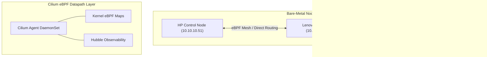

# Architecture Blueprint: Cilium eBPF CNI & Security

## 1. Abstract
* **Purpose:** Establishes eBPF-powered container networking, Kube-Proxy replacement, native routing acceleration, and Zero-Trust network policies across the bare-metal Kubernetes enclave.
* **Platform Tier:** Layer II (Logical Network & Provisioning)
* **Owner:** Platform Engineering & Network Enclave Security

---

## 2. Logical Design



* **Service Type:** DaemonSet (`cilium-agent`), Deployment (`cilium-operator`, `hubble-relay`, `hubble-ui`).
* **Namespace:** `kube-system`
* **Communication Pattern:** Direct L2/L3 native routing with eBPF acceleration; bypasses iptables/kube-proxy overhead.

---

## 3. Implementation Details

* **Repository Path:** `infrastructure/networking/cilium/` (or OpenTofu / Helm helm_release)
* **Key Configuration Parameters:**
  * `kubeProxyReplacement: true`
  * `routingMode: native`
  * `ipv4NativeRoutingCIDR: 10.10.10.0/24`
  * `ipam.mode: kubernetes`

---

## 4. Resilience & Failure Domains

* **DaemonSet Isolation:** One Cilium agent pod runs per physical host node.
* **Datapath Continuity:** eBPF maps reside in kernel memory; container datapath continues routing even if an agent pod restarts.
* **Quorum Independence:** Node-local eBPF datapath operates independently of control plane API availability for established pod-to-pod flows.

---

## 5. Security Posture

* **Zero-Trust Network Policies:** Supports `CiliumNetworkPolicy` enforcing default-deny pod-to-pod traffic rules.
* **eBPF Security Probes:** Real-time visibility into socket calls and process-to-network traffic bindings via Hubble.

---

## 6. Verification & Validation (DoD)

```bash
# 1. Verify Cilium DaemonSet and Operator Health
kubectl get pods -n kube-system -l k8s-app=cilium

# 2. Check Cilium Agent Status via Talos/Kubectl
kubectl exec -n kube-system ds/cilium -- cilium status --brief

# 3. Test Inter-Node Pod Connectivity
kubectl exec -n kube-system ds/cilium -- cilium connectivity test
```
