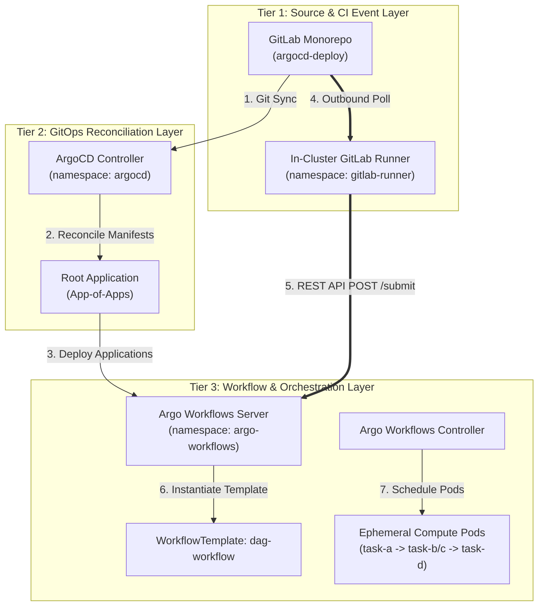

# Architecture Blueprint: GitOps & Workflow Orchestration (ArgoCD & Argo Workflows)

## 1. Abstract
* **Purpose:** Establishes continuous delivery, declarative GitOps reconciliation, and container-native DAG state machine execution across the bare-metal Kubernetes enclave.
* **Platform Tier:** Layer III (Management Plane) & Layer IV (Workload Orchestration)
* **Owner:** Platform Engineering & ORSA Systems Architect

---

## 2. Logical Design



* **Service Type:** Deployment (`argo-cd-server`, `argo-server`, `gitlab-runner`) & Custom Resource Definitions (`Workflow`, `WorkflowTemplate`, `Application`).
* **Namespaces:** `argocd`, `argo-workflows`, `gitlab-runner`.
* **Communication Pattern:** 
  * North-South: Outbound HTTPS polling from `gitlab-runner` to `gitlab.com` (TCP 443).
  * East-West: Internal L2/L3 REST API submittal over CoreDNS (`https://argo-server.argo-workflows.svc:2746`).

---

## 3. Implementation Details

* **Repository Paths:**
  * `argocd/root-app.yaml` & `argocd/apps/` (App-of-Apps pattern)
  * `infrastructure/bootstrap/argo-workflows/` (Argo Workflows & `dag-workflow-template.yaml`)
  * `infrastructure/bootstrap/gitlab-runner/` (In-cluster runner agent)
* **Out-of-Band Cluster Secret Provisioning:**
  To enforce the "Zero-Token-in-Git" security posture, sensitive credentials are created directly in the cluster out-of-band prior to ArgoCD deployment:
  ```bash
  # 1. Provision runner authentication token secret
  kubectl create secret generic gitlab-runner-secret \
    -n gitlab-runner \
    --from-literal=runner-registration-token="glrt-YOUR_RUNNER_AUTHENTICATION_TOKEN"

  # 2. Extract Bearer token for ARGO_WORKFLOW_TOKEN in GitLab CI/CD Variables
  kubectl get secret gitlab-ci-runner-token -n argo-workflows -o jsonpath='{.data.token}' | base64 --decode | tr -d '\r\n'
  ```
* **Key Configuration Parameters:**
  * `targetRevision: argocd-deploy`
  * `syncOptions: [CreateNamespace=true]` (Standard 3-way merge diff)
  * ServiceAccount RBAC: `gitlab-ci-runner` ServiceAccount bound to `workflow-submitter` Role.

---

## 4. Resilience & Failure Domains

* **Replication Factor:** Replicas scale across physical control and worker nodes.
* **Ephemeral Footprint:** Ephemeral DAG task pods exist strictly for the duration of execution, eliminating idle memory footprints.
* **Fault Isolation:** Worker node failure causes Kubernetes to reschedule active DAG tasks to surviving nodes without corrupting pipeline state.

---

## 5. Security Posture

* **Zero Inbound WAN Surface:** Local `gitlab-runner` polls outbound over HTTPS; no router port forwarding or public IP exposure.
* **RBAC Scoping:** `gitlab-ci-runner` ServiceAccount is restricted to `Workflow` and `WorkflowTemplate` CRUD verbs in namespace `argo-workflows`.
* **Zero-Token-in-Git:** Sensitive runner tokens and Bearer tokens are provisioned out-of-band via cluster secrets (`gitlab-runner-secret`, `gitlab-ci-runner-token`).

---

## 6. Verification & Validation (DoD)

```bash
# 1. Verify ArgoCD Applications
kubectl get applications -n argocd

# 2. Verify Argo Workflows Controller & Server
kubectl get pods -n argo-workflows

# 3. Verify Local Runner Status
kubectl get pods -n gitlab-runner

# 4. Trigger REST API Submittal (AWS Step Functions Parity)
curl -k -f -X POST "https://argo-server.argo-workflows.svc:2746/api/v1/workflows/argo-workflows/submit" \
  -H "Authorization: Bearer ${TOKEN}" \
  -H "Content-Type: application/json" \
  -d '{"resourceKind":"WorkflowTemplate","resourceName":"dag-workflow"}'
```
