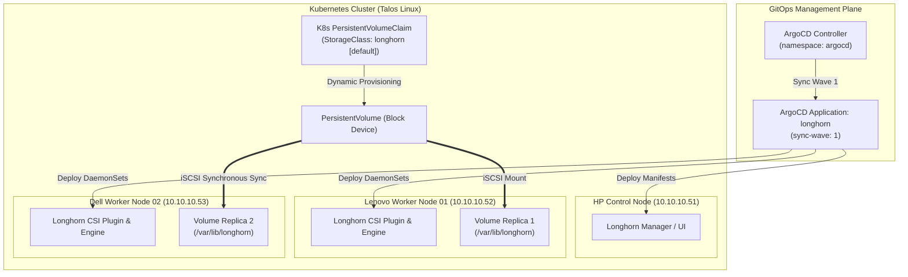

# Architecture Blueprint: Longhorn Distributed Storage (Feature 3.2)

## 1. Abstract
* **Purpose:** Establishes resilient, distributed, persistent block storage dynamic volume provisioning across bare-metal Talos Linux nodes for analytic and cluster state workloads.
* **Platform Tier:** Layer II (Storage & Physical Enclave Interface) & Layer III (Management Layer)
* **Owner:** Platform Engineering & ORSA Systems Architect

---

## 2. Logical Design



* **Service Type:** DaemonSet (`longhorn-manager`, `longhorn-csi-plugin`), Deployment (`longhorn-ui`, `csi-attacher`, `csi-provisioner`), Custom Resource Definitions (`nodes.longhorn.io`, `volumes.longhorn.io`).
* **Namespace:** `longhorn-system` (Privileged PSA).
* **Communication Pattern:**
  * Host-Level: iSCSI target over TCP / local block device loop (`iscsi-tools` extension v0.2.0).
  * Node-to-Node: Synchronous volume replication over Cilium CNI enclave network (TCP 9500-9501).

---

## 3. Implementation Details

* **Repository Paths:**
  * `infrastructure/storage/longhorn/` (`namespace.yaml`, `values.yaml`, `kustomization.yaml`)
  * `infrastructure/storage/README.md` (Subsystem documentation)
  * `argocd/apps/longhorn.yaml` (ArgoCD Application manifest)
  * `argocd/apps/README.md` (App-of-Apps registry)
* **Talos OS Extensions & System Prerequisites:**
  * Extensions active across all 3 nodes (`10.10.10.51`, `10.10.10.52`, `10.10.10.53`): `siderolabs/iscsi-tools` (v0.2.0) and `siderolabs/util-linux-tools` (2.42.2).
  * Host Mount Location: `/var/lib/longhorn` on existing OS file system partitions.
* **Key Configuration Parameters:**
  * `persistence.defaultClass: true` (Sets `longhorn` as default K8s StorageClass)
  * `persistence.defaultClassReplicaCount: 2` (Enforces 2x volume replication across worker nodes)
  * `csi.kubeletRootDir: "/var/lib/kubelet"`
  * `replicaAutoBalance: "least-effort"`

---

## 4. Resilience & Failure Domains

* **Replication Factor:** `2` replicas per volume synchronously mirrored across worker nodes (`10.10.10.52` and `10.10.10.53`).
* **Node Loss Resilience:** If one worker node experiences hardware failure or power cycle, Longhorn automatically continues serving I/O from the surviving worker node replica without workload disruption.
* **Auto-Rebuilding:** Upon worker node recovery, Longhorn synchronizes block deltas to rebuild replica consistency automatically.

---

## 5. Security Posture

* **Namespace Privileged Scoping:** Namespace `longhorn-system` is explicitly annotated with `pod-security.kubernetes.io/enforce: privileged` to permit required iSCSI host path mounts and block device bindings.
* **Workload Isolation:** Non-privileged workload pods consume storage via standard K8s `PersistentVolumeClaim` objects without requiring host privileges.

---

## 6. Verification & Validation (Definition of Done)

```bash
# 1. Verify Talos OS extensions
talosctl get extensions --nodes 10.10.10.51,10.10.10.52,10.10.10.53

# 2. Verify ArgoCD Application deployment
kubectl get application -n argocd longhorn

# 3. DoD Criterion 1 Validation: Longhorn nodes report healthy
kubectl get nodes.longhorn.io -n longhorn-system

# 4. DoD Criterion 2 Validation: StorageClass 'longhorn' set as default
kubectl get storageclass

# 5. Dynamic Provisioning Test
kubectl create ns storage-test
kubectl apply -f - <<EOF
apiVersion: v1
kind: PersistentVolumeClaim
metadata:
  name: longhorn-pvc-test
  namespace: storage-test
spec:
  accessModes:
    - ReadWriteOnce
  resources:
    requests:
      storage: 1Gi
EOF
kubectl get pvc -n storage-test longhorn-pvc-test
kubectl delete ns storage-test
```
