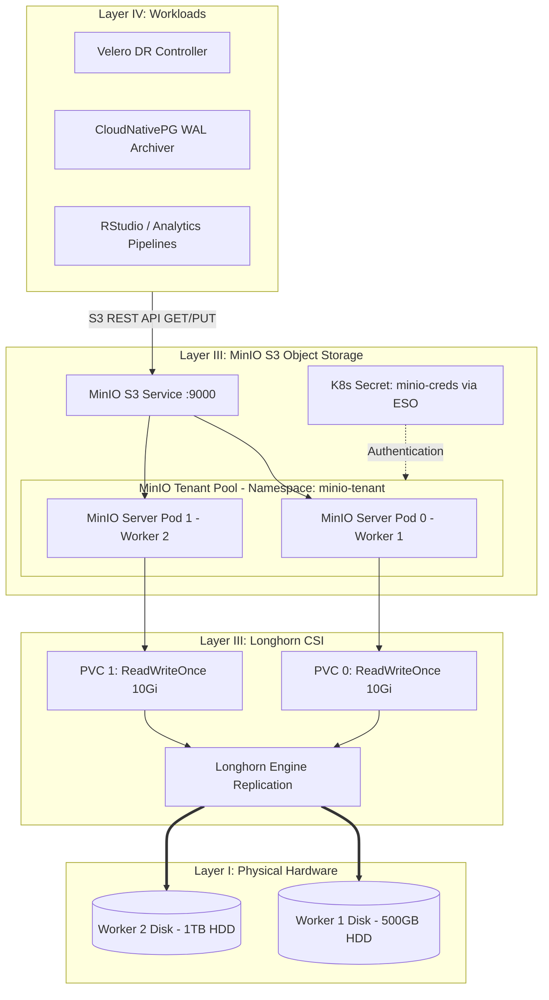

# Architecture Blueprint: Object Storage Foundation (MinIO)

## 1. Abstract
**Purpose**: Provisions an on-premise, enterprise S3-compatible object storage layer using the MinIO Operator and Tenant CRD backed by Longhorn distributed block storage.  
**Platform Tier**: Layer III (Management / Shared Infrastructure Services)  
**Owner**: Platform Engineering

---

## 2. Logical Design & System Concepts

### 2.1 MinIO vs. Longhorn Architecture
| Component | Longhorn (CSI Engine) | MinIO (Object Storage Engine) |
| :--- | :--- | :--- |
| **Platform Layer** | Layer III (Block/File Storage CSI) | Layer III (S3 Object Storage Engine) |
| **Storage Interface** | Raw Block / POSIX Volume (`/dev/sdX` / PVC) | HTTP/HTTPS S3 REST API (`GET`, `PUT`, `LIST`) |
| **Data Abstraction** | Ext4/XFS Filesystem Blocks | Key-Value Metadata + Unstructured Objects |
| **Primary Function** | Manages physical disk blocks & node volume replication | Provides S3 endpoint, bucket management, and policies |
| **Relationship** | **Underlying Provider:** Supplies PVCs to MinIO server pods | **Consumer:** Runs on top of Longhorn block volumes |

### 2.2 Tangible Value of S3 API Compatibility
1. **Universal Protocol Interface:** Downstream applications (Velero backups, CloudNativePG WAL archiver, RStudio/Python analytical pipelines, KubeFlow ML artifacts) interact via standard S3 SDKs (`boto3`, `aws-cli`, `rest API`) rather than mounting local filesystems or PVCs.
2. **Cloud-Native Portability:** Any tool designed for AWS S3 can run on-premise without code modifications simply by overriding the S3 endpoint (`http://minio.minio-tenant.svc.cluster.local:9000`).

### 2.3 Visual Architectural Interaction



---

## 3. Implementation Details

### 3.1 Decoupled ArgoCD 2-App Pattern
MinIO is deployed as **two separate ArgoCD Applications** to isolate failure domains:
- **`minio-operator.yaml` (Sync Wave 1):** Subscribes to official Helm chart (`https://operator.min.io/`) to install Custom Resource Definitions (`tenants.minio.min.io`) and the cluster-wide controller in `minio-operator` namespace.
- **`minio-tenant.yaml` (Sync Wave 2):** Tracks `infrastructure/storage/minio` to deploy instance custom resources (`Tenant`, `ExternalSecret`, `Job`) in `minio-tenant` namespace.

*Rationale:* CRDs must be fully registered in the Kubernetes API before ArgoCD evaluates `Tenant` manifests. Furthermore, operator restarts do not disrupt active data plane storage pods.

### 3.2 Storage Access Mode & Replication Optimization (`ReadWriteOnce` & Longhorn Replica Tuning)
Individual MinIO server pods mount Longhorn PVCs using `ReadWriteOnce` (RWO) access mode.
- **Why RWO?** Distributed object stores manage erasure coding, volume locking, and data integrity at the application layer. Direct unmediated block access (RWO) per server pod prevents POSIX lock contention and filesystem corruption.
- **Multi-Client Access:** Concurrent multi-client read/write (`ReadWriteMany` access pattern) is served at the **S3 HTTP API layer** over network endpoints, while underlying disk volumes remain strictly single-writer block devices.
- **HDD Performance & Write Amplification Optimization:** Mechanical HDDs suffer from low IOPS (~100-200 IOPS). Feature 3.4 utilizes the existing default `longhorn` StorageClass (`storageClassName: longhorn`). If write amplification tuning is required in future iterations, a custom StorageClass with `numberOfReplicas: 1` can be provisioned to delegate node resiliency entirely to MinIO's application pool.

### 3.3 Storage Capacity & Dynamic Expansion
- **Baseline Allocation:** Initial PVC size is provisioned at `10Gi` per server volume as a conservative baseline to preserve physical disk capacity on worker nodes (`worker-1`: 500GB HDD, `worker-2`: 1TB HDD).
- **Vertical Expansion (Dynamic PVC Resize):** Longhorn supports dynamic volume expansion (`allowVolumeExpansion: true`). Storage capacity can be vertically scaled by modifying the PVC storage request in `infrastructure/storage/minio/tenant.yaml` (e.g., `10Gi` -> `50Gi`) once provisioned in Phase 2; Longhorn resizes the filesystem online without service interruption.
- **Horizontal Expansion (MinIO Pools):** In MinIO Operator v6+, `volumesPerServer` is immutable within an existing pool. Large capacity additions are performed horizontally by appending a new `pool` block to the `Tenant` custom resource.

### 3.3 Zero-Token-in-Git Secret Integration
Administrative root credentials (`rootUser` and `rootPassword`) are managed out-of-git in GitLab CI/CD variables and hydrated dynamically by External Secrets Operator:
- **`ExternalSecret` Manifest:** `infrastructure/storage/minio/tenant-secret.yaml`
- **Target Secret:** `minio-creds` in namespace `minio-tenant`
- **Secret Keys:** `config.env` formatted payload consumed by MinIO Tenant spec.

---

## 4. Resilience & Failure Domains

- **Node Failures:** The MinIO Tenant pool spans 2 worker nodes (`worker-1` on `10.10.10.52` and `worker-2` on `10.10.10.53`). Longhorn maintains block replication across nodes.
- **WAN Outages:** S3 object storage operations continue without disruption during WAN outages. Secret rehydration via ESO caches existing `minio-creds` in `etcd`.
- **Data Persistence:** Disks are backed by physical SATA HDDs formatted via Longhorn.

---

## 5. Security Posture

- **Namespace Isolation:** Operator runs in `minio-operator`; Tenant runs in `minio-tenant`.
- **Credential Governance:** Zero plain-text credentials stored in version control.
- **Network Boundaries:** Internal cluster DNS (`minio.minio-tenant.svc.cluster.local:9000`) restricts S3 API traffic to cluster-internal network policies.

---

## 6. Verification & Validation (DoD)

- **Command 1 (Operator):** `kubectl get pods -n minio-operator -l app.kubernetes.io/name=operator`
- **Command 2 (CRD):** `kubectl get crd tenants.minio.min.io`
- **Command 3 (Tenant & PVCs):** `kubectl get tenant,pods,pvc -n minio-tenant`
- **Command 4 (S3 Endpoint Health):** 
  ```bash
  kubectl run s3-test --rm -i --tty --image=curlimages/curl -- \
    curl -s -I http://minio.minio-tenant.svc.cluster.local:9000/minio/health/live
  ```
