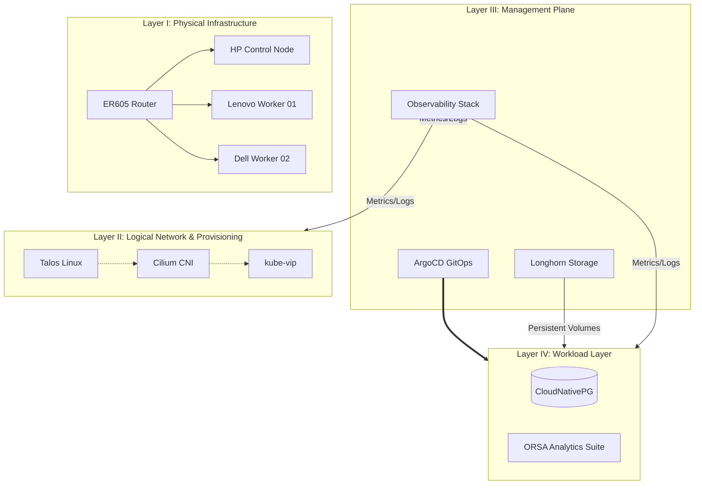

# The "How" - System Intent

This is the Blueprint. It describes the logical and theoretical design of the system, often independent of the specific hardware used.

Content: High-level diagrams (Mermaid/Visio), Network Topology maps (VLAN logic), and Security Models (Zero-Trust boundaries).

Scope: The "North Star" design that guides implementation.

# Platform Architecture & Design Blueprints

## 1. Overview
This directory contains the technical specifications and blueprints for the GitOps Lab. We utilize a **4-Tier Platform Architecture** to isolate failure domains and maintain clear boundaries between physical hardware, the immutable OS, cluster management services, and analytic workloads.

## 2. Visual Model (Logical)
The following diagram illustrates the vertical integration of the platform layers and the primary traffic/dependency flows.

## 3. Blueprint Index

| Component | Layer | Status | Document |
| :--- | :--- | :--- | :--- |
| Physical Networking | Layer I | Complete | [01-physical-network.md](./01-physical-network.md) |
| Talos Provisioning | Layer II | Complete | [02-talos-os.md](./02-talos-os.md) |
| Cilium CNI | Layer II | Complete | [03-cilium-security.md](./03-cilium-security.md) |
| GitOps & Orchestration | Layer III/IV | Complete | [04-gitops-and-orchestration.md](./04-gitops-and-orchestration.md) |
| Longhorn Storage | Layer III | Complete | [05-distributed-storage.md](./05-distributed-storage.md) |