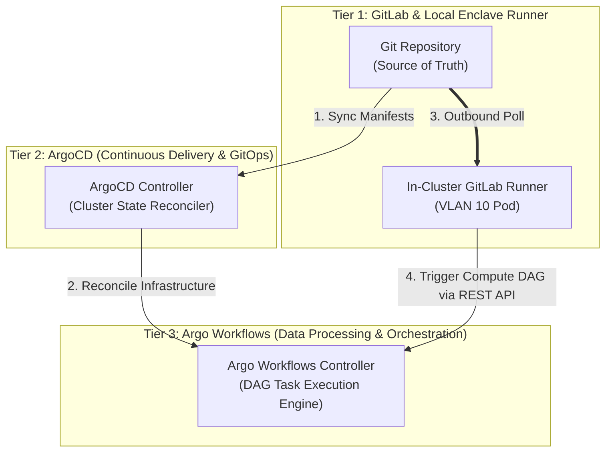

# Argo Workflows Infrastructure Layer (`/infrastructure/bootstrap/argo-workflows`)

This directory contains the declarative manifests for **Argo Workflows**, the container-native workflow engine for Kubernetes.

---

## Architectural Separation of Concerns

To prevent configuration drift and operational conflation, the platform enforces a strict 3-tier separation of responsibilities:

---

## Responsibility Matrix

| Platform Layer | Primary Function | Operational Scope | Anti-Patterns (Do NOT do) |
| :--- | :--- | :--- | :--- |
| **GitLab & GitLab CI** | Code Hosting, Linting, Testing, Image Building | Runs unit tests, compiles binaries, builds Docker images, triggers external workflows. | **Do NOT** execute `kubectl apply` directly or manage live cluster state. |
| **ArgoCD (GitOps Engine)** | Continuous Delivery & State Management | Reconciles cluster state against Git manifests. Deploys apps, operators, and storage. | **Do NOT** execute unit tests, build Docker images, or run data-processing pipelines. |
| **Argo Workflows** | Orchestrated Compute & Data Processing | Executes ephemeral, multi-step DAG tasks (simulations, ETL, ML training) on K8s nodes. | **Do NOT** manage persistent web services, deployments, or cluster configuration. |

---

> [!NOTE]
> For the full 4-tier platform stack diagram, OS lifecycle management table, and cross-plane orchestration documentation, see [infrastructure/bootstrap/README.md](../README.md).

## GitLab CI & Argo Workflows: AWS Step Functions Parity

In cloud-native architectures, CI/CD pipelines are not solely responsible for building and testing code — they also act as the **event source** that triggers downstream state machine orchestration. On AWS, this pattern manifests as a CodePipeline or GitLab CI job that invokes an **AWS Step Functions** state machine, which then coordinates a multi-step, dependency-aware sequence of compute tasks asynchronously across managed services.

This platform replicates that pattern on bare-metal Kubernetes using **GitLab CI → Argo Workflows**:

| AWS Cloud Pattern | Bare-Metal Homelab Equivalent |
| :--- | :--- |
| GitLab CI / CodePipeline job | GitLab CI pipeline stage |
| AWS Step Functions state machine | Argo `WorkflowTemplate` (`dag-workflow`) |
| Lambda functions / ECS tasks (steps) | Ephemeral Kubernetes pod templates (DAG task nodes) |
| Step Functions execution trigger (API call) | `curl` POST to Argo Workflows REST API (`/api/v1/workflows/argo-workflows/submit`) |
| Step Functions IAM role | Kubernetes `ServiceAccount` + `Role` + `RoleBinding` (`gitlab-ci-runner`) |

### Execution Pattern

A GitLab CI pipeline stage issues an authenticated HTTP request to the **Argo Workflows API server**, submitting a `WorkflowTemplate` or `Workflow` resource for execution. Argo Workflows then:
1. Instantiates a DAG graph from the submitted template.
2. Schedules individual task nodes as ephemeral Kubernetes pods, honoring declared dependencies.
3. Executes parallel branches concurrently when upstream dependencies are satisfied.
4. Tears down all task pods upon DAG completion, leaving no persistent resource footprint.

This pattern **offloads heavy analytical computation** (Monte Carlo simulations, ETL pipelines, ML training runs) from the lightweight GitLab CI runner into the full resource capacity of the Kubernetes cluster, while preserving the CI pipeline as the authoritative event trigger.

### Scope Boundary

GitLab CI's role in this integration is strictly limited to **event emission** — it submits a workflow and monitors the resulting execution status. It does not manage cluster state, does not apply Kubernetes manifests, and does not interact with ArgoCD. Cluster state remains exclusively managed by ArgoCD via GitOps sync.
