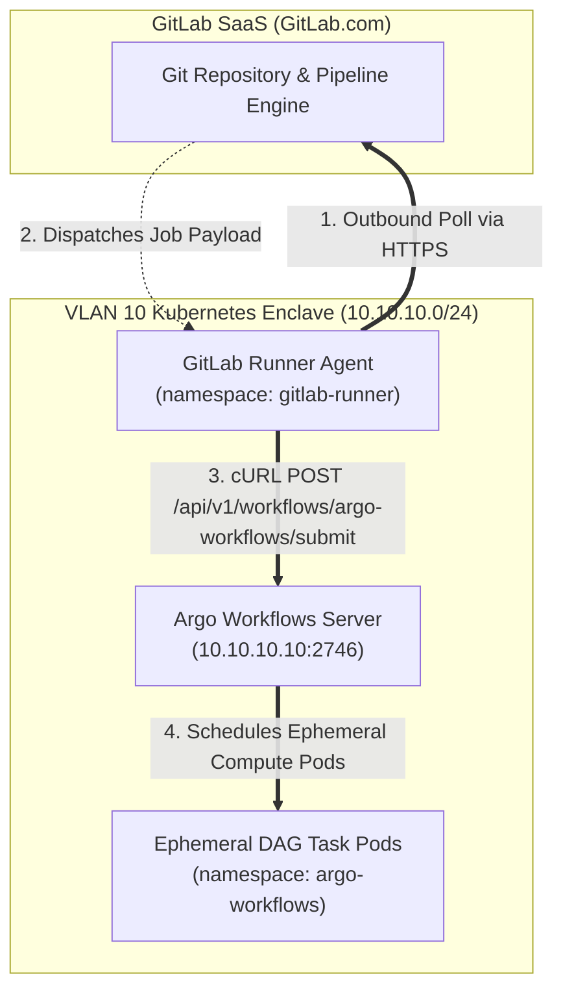

# GitLab Runner Infrastructure Layer (`/infrastructure/bootstrap/gitlab-runner`)

This directory contains the declarative manifests for deploying an in-cluster **GitLab Runner** agent in namespace `gitlab-runner`.

---

## Architectural Purpose & Zero-Trust Design



### Key Engineering Attributes
* **Zero Inbound Network Perimeter:** The runner pod connects *outbound* to `gitlab.com` over HTTPS (TCP 443). No inbound port forwarding, public IP addresses, or WAN firewall changes are required on the ER605 router.
* **Local Enclave L2/L3 Access:** Executing inside VLAN 10 allows the runner to directly invoke the Argo Server REST API (`https://10.10.10.10:2746`) over local interfaces.
* **Quota Offloading:** Pipeline jobs assigned to `tags: [homelab-runner]` execute on local cluster worker nodes and consume **0 compute minutes** from the 400-minute GitLab SaaS Free Tier quota.

---

## Provisioning & Authentication Token Setup

1. **Obtain Project Runner Authentication Token:**
   - In GitLab UI, navigate to: **Settings $\rightarrow$ CI/CD $\rightarrow$ Runners**.
   - Click **New project runner**.
   - Set tag to: `homelab-runner`.
   - Click **Create runner** and copy the generated **runner authentication token** (`glrt-...`).

2. **Provision Cluster Secret Out-of-Band:**
   - Create the secret directly in the cluster (or manage via External Secrets Operator in Feature 3.3) so zero plain-text tokens touch version control:
     ```bash
     kubectl create secret generic gitlab-runner-secret \
       -n gitlab-runner \
       --from-literal=runner-registration-token="glrt-YOUR_REAL_TOKEN"
     ```

3. **Verify Registration:**
   ```bash
   kubectl get pods -n gitlab-runner
   kubectl logs -n gitlab-runner -l app=gitlab-runner --tail=50
   ```
